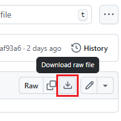

# RankingQuagga
[Quagga](https://quagga.studio) APIと連携して成績情報を反映するPowerPointプラグインです。

## 機能
- ピリオド成績
- 総合成績

## ファイル
- srcフォルダ: RankingQuagga.pptmを解凍したもの
- imagesフォルダ: README用画像
- RankingQuagga.ppam: **プラグイン本体**
- RankingQuagga.pptm: 編集用

## インストール
1. Github上の[RankingQuagga.ppam](RankingQuagga.ppam)のページに飛ぶ
2. "Download raw file"をクリックしてプラグイン本体をダウンロード  

3. "%APPDATA%\Roaming\Microsoft\AddIn"にコピー

## Dependencies
- VBA-JSON (MIT License): https://github.com/VBA-tools/VBA-JSON
- VBA-Dictionary (MIT License): https://github.com/VBA-tools/VBA-Dictionary
