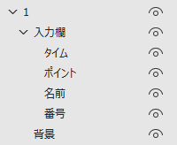
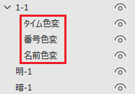

# RankingQuagga
[Quagga](https://quagga.studio) APIと連携して成績情報を反映するPowerPointプラグインです。

## 機能
- 早押しトップ10
- 予選落ち
- ピリオド成績
- 総合成績
- 賞金ランキング

## ファイル
- srcフォルダ: ~~RankingQuagga.pptmを解凍したもの~~→customUI14.xmlを残し削除
- vba-srcフォルダ: VBAソース、[Github Actions](.github/workflows/action.yml)により展開
- imagesフォルダ: README用画像
- mockフォルダ: テストサーバーのソース
- RankingQuagga.ppam: **プラグイン本体**
- RankingQuagga.pptm: 編集・ソース公開用

## インストール
1. Github上の[RankingQuagga.ppam](RankingQuagga.ppam)のページに飛ぶ
2. "Download raw file"をクリックしてプラグイン本体をダウンロード  
  
これ以降はOfficeバージョンによって差異がある可能性アリ
3. "%APPDATA%\Microsoft\AddIns"にコピー
4. "ファイル"→"オプション"→"アドイン"→"管理"項目の"PowerPointアドイン"を選択し"設定"をクリック
5. "新規追加"より3.でコピーしたプラグイン本体を選択
6. "RankingQuagga"にチェックがついていることを確認し、設定ウィンドウを閉じる

## 使い方(共通)
1. リボンの"RankingQuagga"タブを選択
2. "設定"をクリック
3. イベントIDと秘密の暗号を入力  
\(サーバーは"テストサーバー"を選択する必要はない。テストサーバーについては[mockフォルダ](mock)を参照)
4. "保存"をクリック。設定内容はファイル毎に保存される。
5. 成績を反映させるオブジェクト名を下図のように編集(階層はこの通りでなくてよい、"番号"はランクの意)  
  
最上位や最下位の表示色が変わるスライドでは該当のオブジェクト名を下図のように編集(色変更前か変更後のどちらか)、同時一位/同時予選落ちには対応していない。  
  
非表示になっているオブジェクトは反映の対象外になる。

### 早押しトップ10
1. 成績を反映させる予定のスライドを選択した状態で"RankingQuagga"タブの"早押しトップ10を反映"をクリック

### 予選落ち
1. 成績を反映させる予定のスライドを選択した状態で"RankingQuagga"タブの"予選落ちを反映"をクリック

### ピリオド成績
1. 成績を反映させる予定のスライドを選択した状態で"RankingQuagga"タブの"ピリオド成績を反映"をクリック

### 総合成績
総合成績は2枚スライドが必要になる。下位を表示する用のスライドと、トップ10を表示する用のスライドである。  
マクロを実行すると下位を表示する用のスライドが複製される。そのため<ins>プレゼンテーションファイルを独立させることを推奨する。</ins>
1. 下位を表示する用のスライドを選択した状態で"RankingQuagga"タブの"総合成績を反映"をクリック
2. 何人分のデータを表示する~~か、スライド当たり何人表示する~~か尋ねるダイアログが表示されるが、基本的には何も入力せず"OK"をクリックするかEnterでよい。

トップ10のみを表示したい場合は、トップ10を表示する用のスライドを選択した状態で実行すればよい。

### 賞金ランキング
準備、操作は[総合成績](#総合成績)とほぼ同様。"RankingQuagga"タブの"賞金ランキングを反映"をクリックして実行。

### 自動反映
プレゼンテーション中にマクロを動作させることができる機能。早押しトップ10、予選落ち、ピリオド成績にて対応  
1. 成績を反映させる予定のスライドを選択した状態で"RankingQuagga"タブの"自動反映用シェイプを配置"をクリック
2. 表示されるフォームから対応させたい機能を選択
3. **プレゼンテーションの直前に**"自動反映を有効"をクリック

プレゼンテーション中にテキストを操作しているせいかテキストスタイルがうまく読み込めない症状を確認しているが、作成者が動作確認しているPCがかなり前のものであるのが原因の可能性がある。

## 注意
- 問題スライドを編集しているときにマクロを実行しない。
- マクロの動作を確認する前、プレゼンテーションする前にはバックアップを取る。

## Dependencies
- VBA-JSON (MIT License): https://github.com/VBA-tools/VBA-JSON
- VBA-Dictionary (MIT License): https://github.com/VBA-tools/VBA-Dictionary
