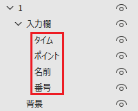

# RankingQuagga
[Quagga](https://quagga.studio) APIと連携して成績情報を反映するPowerPointプラグインです。

## 機能
- ピリオド成績
- 総合成績

## ファイル
- srcフォルダ: RankingQuagga.pptmを解凍したもの
- imagesフォルダ: README用画像
- mockフォルダ: テストサーバーのソース
- RankingQuagga.ppam: **プラグイン本体**
- RankingQuagga.pptm: 編集・ソース公開用

## インストール
1. Github上の[RankingQuagga.ppam](RankingQuagga.ppam)のページに飛ぶ
2. "Download raw file"をクリックしてプラグイン本体をダウンロード  
  
これ以降はOfficeバージョンによって差異がある可能性アリ
3. "%APPDATA%\Microsoft\AddIns"にコピー
4. "ファイル"→"オプション"→"アドイン"→"管理"項目の"PowerPointアドイン"を選択し"設定"をクリック
5. "新規追加"より3.でコピーしたプラグイン本体を選択
6. "RankingQuagga"にチェックがついていることを確認し、設定ウィンドウを閉じる

## 使い方(共通)
1. リボンの"RankingQuagga"タブを選択
2. "設定"をクリック
3. イベントIDと秘密の暗号を入力  
\(サーバーは"テストサーバー"を選択する必要はない。テストサーバーについては[mockフォルダ](mock)を参照)
4. "保存"をクリック。設定内容はファイル毎に保存される。
5. 成績を反映させるオブジェクト名を下図のように編集(階層はこの通りでなくてよい、"番号"はランクの意)  

### ピリオド成績
1. 成績を反映させる予定のスライドを選択した状態で"RankingQuagga"タブの"ピリオド成績を反映"をクリック

### 総合成績
総合成績は2枚スライドが必要になる。下位を表示する用のスライドと、トップ10を表示する用のスライドである。  
マクロを実行すると下位を表示する用のスライドが複製される。
1. 下位を表示する用のスライドを選択した状態で"RankingQuagga"タブの"総合成績を反映"をクリック
2. 何人分のデータを表示するか、スライド当たり何人表示するか尋ねるダイアログが表示されるが、基本的には何も入力せず"OK"をクリックするかEnterでよい。

トップ10のみを表示したい場合は、トップ10を表示する用のスライドを選択した状態で実行すればよい。

### 自動反映
実装しているが、プレゼンテーション中にテキストを操作するとスタイルがうまく読み込めないようなので非推奨  
よって使い方はここには記載しない。

## 注意
- 問題スライドを編集しているときにマクロを実行しない。
- マクロの動作を確認する前、プレゼンテーションする前にはバックアップを取る。
- 総合成績を表示するスライドはプレゼンテーションファイルを独立させることを推奨する。スライドを複製する動作を含むため。
- 上位の表示色が変わるような場合に、色が変わる前と後の両方に情報を反映するような機能は無い。  
色が変わる前のオブジェクト名を変更する対応がベター(オブジェクトを消してしまうと、紐づいているアニメーションごと消してしまう場合がある)。

## Dependencies
- VBA-JSON (MIT License): https://github.com/VBA-tools/VBA-JSON
- VBA-Dictionary (MIT License): https://github.com/VBA-tools/VBA-Dictionary
